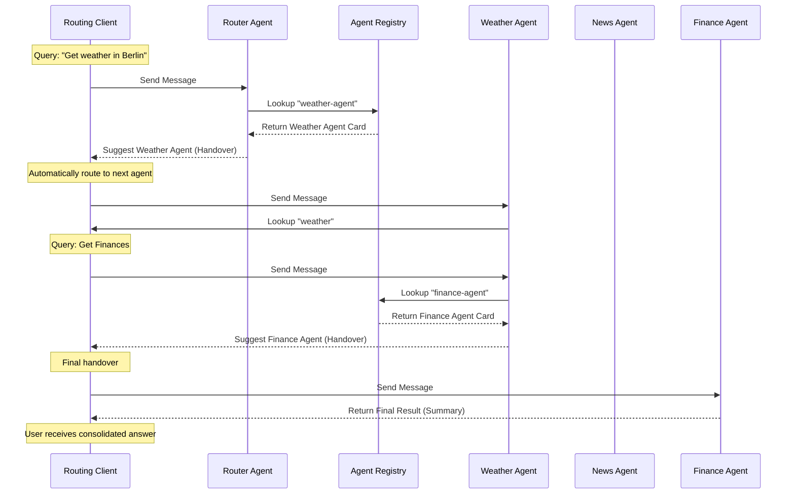

# distributed-a2a

### About this repository
`distributed-a2a` is a Python library designed for building and orchestrating A2A (Agent-to-Agent) agents with robust routing capabilities. It provides the necessary components to register agents, manage their lifecycles, and enable seamless communication between them through a centralized or distributed registry.

Key features include:
- **Registry Service**: A centralized server for agent discovery and Model Context Protocol (MCP) management.
- **Agent Server**: A FastAPI-based application wrapper for hosting agents with built-in heartbeat and registration logic.
- **Router Agent**: A specialized agent that uses the registry to route requests to the most appropriate agent based on their capabilities.
- **Routing Client**: An intelligent client capable of navigating through multiple agents based on the task requirements.

#### Traffic Flow Diagram
The diagram below illustrates the communication flow between the **Routing Client**, the **Router**, the **Registry**, and three example agents (**Weather**, **News**, and **Finance**) during a complex request.



### Start a Registry service
The registry service acts as a directory for all available agents. You can start a registry service using the provided bootstrap logic.

```python
import uvicorn
from distributed_a2a.registry_server.bootstrap import load_registry
from distributed_a2a.registry_server.in_memory_registry_storage import (
    InMemoryAgentRegistry, 
    InMemoryMcpRegistry
)

# Initialize in-memory storage for the registry
agent_registry = InMemoryAgentRegistry()
mcp_registry = InMemoryMcpRegistry()

# Create the FastAPI application
app = load_registry(agent_registry=agent_registry, mcp_registry=mcp_registry)

if __name__ == "__main__":
    uvicorn.run(app, host="0.0.0.0", port=8000)
```

### Start a Agent
To start an agent, you need to provide an `AgentConfig` which includes information about the agent's capabilities, the LLM it uses, and the registry it should register with.

```python
import uvicorn
from distributed_a2a.server import load_app
from distributed_a2a.model import AgentConfig

# Define your agent configuration
config_data = {
    "agent": {
        "card": {
            "name": "weather-agent",
            "description": "An agent that provides weather information",
            "version": "1.0.0",
            "url": "http://localhost:8001/weather-agent"
        },
        "llm": {
            "base_url": "https://api.openai.com/v1",
            "model": "gpt-4",
            "api_key_env": "OPENAI_API_KEY"
        },
        "registry": {
            "agent": {"url": "http://localhost:8000"}
        },
        "system_prompt": "You are a helpful weather assistant."
    }
}

agent_config = AgentConfig(**config_data)

# Create the FastAPI application for the agent
app = load_app(agent_config=agent_config)

if __name__ == "__main__":
    uvicorn.run(app, host="0.0.0.0", port=8001)
```

### Start a Router
A router is a specialized agent that helps redirect requests to the most suitable agent based on the query. It uses the registry to look up available agent capabilities.

```python
import uvicorn
from distributed_a2a.router import load_router
from distributed_a2a.model import RouterConfig

# Define your router configuration
config_data = {
    "router": {
        "card": {
            "name": "router-agent",
            "description": "An agent that routes requests to other agents",
            "version": "1.0.0",
            "url": "http://localhost:8002/router-agent"
        },
        "llm": {
            "base_url": "https://api.openai.com/v1",
            "model": "gpt-4",
            "api_key_env": "OPENAI_API_KEY"
        },
        "registry": {
            "agent": {"url": "http://localhost:8000"}
        }
    }
}

router_config = RouterConfig(**config_data)

# Create the FastAPI application for the router
app = load_router(router_config=router_config)

if __name__ == "__main__":
    uvicorn.run(app, host="0.0.0.0", port=8002)
```

### Call the agent via the Routing client
The `RoutingA2AClient` allows you to interact with agents. If an agent suggests another agent for a task, the client will automatically route the request.

```python
import asyncio
from distributed_a2a.client import RoutingA2AClient

async def main():
    # Initialize the client with the starting agent's URL (can be the router or a specific agent)
    client = RoutingA2AClient(initial_url="http://localhost:8002/router-agent")
    
    # First message: Ask about the weather
    response = await client.send_message(
        message="What is the weather in Berlin?", 
        context_id="unique-session-id"
    )
    print(f"Weather Agent Response: {response}")

    # Subsequent message: Ask about another topic (the news)
    # The client/agent will identify that the News Agent is better suited and return the Agent Card for handover
    response = await client.send_message(
        message="What are the latest news?", 
        context_id="unique-session-id"
    )
    print(f"News Agent Handover: {response}")

if __name__ == "__main__":
    asyncio.run(main())
```

### Environment Variables
The library uses several environment variables for configuration. These can be set in your shell or via a `.env` file.

#### Agent Environment Variables
| Variable | Description |
| :--- | :--- |
| `API_ROOT_PATH` | (Optional) The root path where the agent's API will be hosted. Defaults to `/{agent_name}`. |
| `HTTPX_LOGGING` | (Optional) Set to `true` to enable detailed logging for HTTP requests. |
| `REGISTRY_AUTH_HEADERS` | (Optional) A JSON string representing a dictionary of headers to be sent to the registry for authentication (e.g., `'{"Authorization": "Bearer your-token"}'`). |
| `MCP_AUTH_HEADER` | (Optional) A JSON string representing a dictionary of default headers for MCP server communication. |
| `MCP_AUTH_HEADER_{SERVICE_NAME}` | (Optional) A JSON string representing a dictionary of headers for a specific MCP service. `{SERVICE_NAME}` should be the uppercase name of the service with hyphens replaced by underscores (e.g., `MCP_AUTH_HEADER_MY_SERVICE` for `my-service`). |
| `LLM_API_KEY` | (Context-dependent) The environment variable name specified in `AgentConfig.agent.llm.api_key_env` (e.g., `OPENAI_API_KEY`) must be set to your LLM provider's API key. |

### Registry configuration
The registry service supports multiple storage drivers for persisting agent cards and MCP server information.

#### In-memory Storage
Ideal for development and testing. Data is lost when the service restarts.

```python
from distributed_a2a.registry_server.in_memory_registry_storage import (
    InMemoryAgentRegistry, 
    InMemoryMcpRegistry
)

agent_registry = InMemoryAgentRegistry()
mcp_registry = InMemoryMcpRegistry()
```

#### DynamoDB Storage
Recommended for production environments requiring persistence and scalability.

```python
from distributed_a2a.registry_server.dynamo_db import (
    DynamoDbAgentRegistryLookup, 
    DynamoDbMcpRegistryLookup
)

agent_registry = DynamoDbAgentRegistryLookup(agent_card_table="your-agent-table")
mcp_registry = DynamoDbMcpRegistryLookup(mcp_table="your-mcp-table")
```

When using the DynamoDB storage driver, ensure the following AWS environment variables are set (AWS credentials can be provided via standard AWS environment variables):

| Variable | Description |
| :--- | :--- |
| `AWS_ACCESS_KEY_ID` | Your AWS access key. |
| `AWS_SECRET_ACCESS_KEY` | Your AWS secret access key. |
| `AWS_DEFAULT_REGION` | The AWS region (e.g., `eu-central-1`). |

### Contribution
Contributions are welcome! If you find a bug or have a feature request, please open an issue on the GitHub repository. To contribute code:

1. Fork the repository.
2. Create a new branch for your feature or bugfix.
3. Write tests for your changes.
4. Submit a pull request.

Please ensure your code adheres to the project's coding standards and passes all linting and tests.

#### Releasing New Versions

This project uses semantic versioning. You can bump versions and publish new releases using the provided `Makefile` targets or the automated GitHub Workflow.

##### Bumping Versions with Makefile

You can manually bump the project version using the following `make` targets:

- `make bump-patch`: Bumps the patch version (e.g., 1.0.0 -> 1.0.1).
- `make bump-minor`: Bumps the minor version (e.g., 1.0.0 -> 1.1.0).
- `make bump-major`: Bumps the major version (e.g., 1.0.0 -> 2.0.0).
- `make bump-version VERSION=x.y.z`: Sets the version to a specific value.

After bumping the version, you can manually publish to PyPI with:
```bash
make upload
```
*Note: This requires `build` and `twine` to be installed and your PyPI credentials configured.*

##### Automated Publishing via GitHub Actions

The preferred way to release a new version is through the **Publish distributed-a2a to PyPI** GitHub Workflow:

1. Go to the **Actions** tab in the GitHub repository.
2. Select the **Publish distributed-a2a to PyPI** workflow.
3. Click **Run workflow**.
4. The workflow will automatically:
    - Run linting and type checks.
    - Bump the patch version.
    - Commit and tag the new version.
    - Build and upload the distribution to PyPI.
